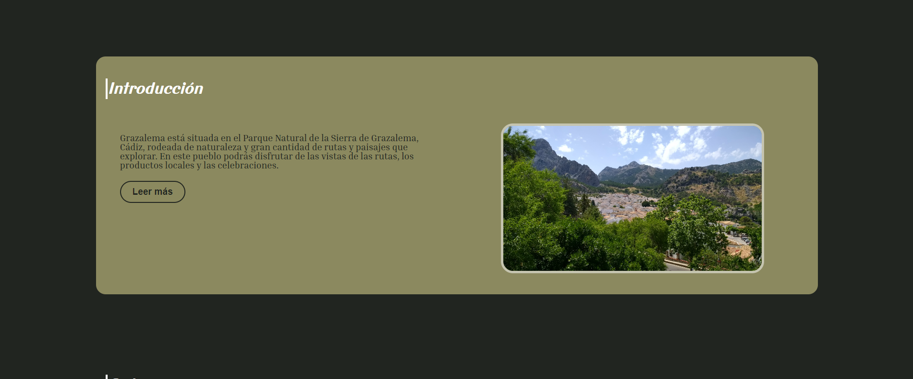
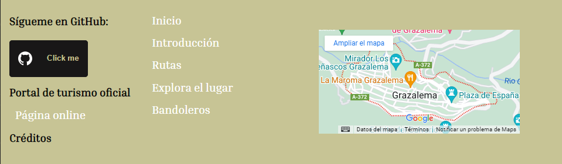

<h1>Memoria del proyecto fin de evaluación de Lenguajes de Marcas - 1º DAW</h1>
<h2>Grazalema - Tribute site</h2>
<h2>Indice</h2>
<ul>
  <li><a href="#introduccion">Introducción</a></li>
  <li><a href="#motivacion">Motivación</a></li>
  <li><a href="#estructura">Estructura</a></li>
  <li><a href="#estilo">Estilo</a></li>
</ul>

<h2 id="introduccion">Introducción</h2>

Trabajo realizado en clase por: Juan Francisco Chacón

Proyecto de web "from scratch" de 1ª evaluación de Lenguajes de Marcas

Diciembre de 2023 

<h2 id="motivacion">Motivación</h2>

El tema lo he elegido porque es el pueblo del que procede parte de mi familia, y tenía gran cantidad de fotografías y contenidos ya guardados

<h2 id="estructura">Estructura</h2>

La web está dividida en  6 secciones:

<ul>
  <li>Hero Section</li>  
  <li>Introducción</li>
  <li>Rutas</li>
  <li>Explorar</li>
  <li>Bandoleros</li>
  <li>Footer</li>
</ul>

<h3>Hero Section</h3>

He utilizado una imagen de fondo tomada de mi galería propia que se adapta fácilmente a diferentes dispositivos 
Sobre ella he colocado un Call to Action que he estilado a partir de un botón procedente de uiverse.io

<h3>Introducción</h3>

He dispuesto en un grid de 2 columnas y presentado brevemente las cosas que se pueden realizar en esta localidad.

También tiene un botón orientado a una futura subpágina donde explicar la información general de forma más desarrollada

El estilado del botón es procedente de uiverse.io

<h3>Rutas</h3>

He dispuesto un grid con columnas para mostrar 4 cards sobre las posibles rutas de senderismo que realizar

El estilado de la card es procedente de uiverse.io

<h3>Explorar</h3>

He dispuesto en una galería un conjunto de imágenes estiladas con overlay.

El estilado de la galería es procedente de w3schools

<h3>Bandoleros</h3>

He dispuesto en un grid columnas de 2 para explicar una serie de fotografías frente a texto breve.

<h3>Footer</h3>

He dispuesto en tres columnas las redes sociales, un enlace a la página oficial de turismo, los créditos respecto a las imágenes y favicon de la página, un navbar breve duplicado, y la localización en google maps del pueblo.

<h2 id="estilo">Estilo de la página</h2>
<h3>Paleta de colores</h3>

He utilizado un conjunto de colores más comunes de las imágenes usadas en la página mediante la página colormind.io

Entre los colores usados son más predominantes el blanco en las letras dado el contraste oscuro del fondo, #212520, y #8B895F

<h3>Tipografías</h3>

He utilizado la tipografía Inria Serif para el texto, y la cursive Sans para los títulos

<h3>Imágenes</h3>

A excepción del favicon, procedente de iconsdb.com, el resto de imágenes proceden de mi galería de imágenes propia

<h2 id="snippets">Code snippets</h2>

He utilizado los siguientes:

<ul>
  <li>Barra de navegación: tomada de w3Schools https://www.w3schools.com/howto/howto_js_topnav_responsive.asp</li>
  <li>Botones: tomados de uiverse.io buttons: https://uiverse.io/nikk7007/chatty-bulldog-58, https://uiverse.io/e-coders/new-shrimp-32</li>
  <li>Cards rutas: tomados de uiverse.io cards: https://uiverse.io/gharsh11032000/selfish-owl-57</li>
  <li>Cards explorar: tomados de w3schools usando overlay: https://www.w3schools.com/howto/howto_css_image_overlay_title.asp<li>
  <li>Accordion Bandoleros: tomado de w3schools: https://www.w3schools.com/howto/howto_js_accordion.asp<li>
  <li>Ventana modal de créditos: tomado de w3schools: https://www.w3schools.com/howto/howto_css_modals.asp</li>
</ul>
